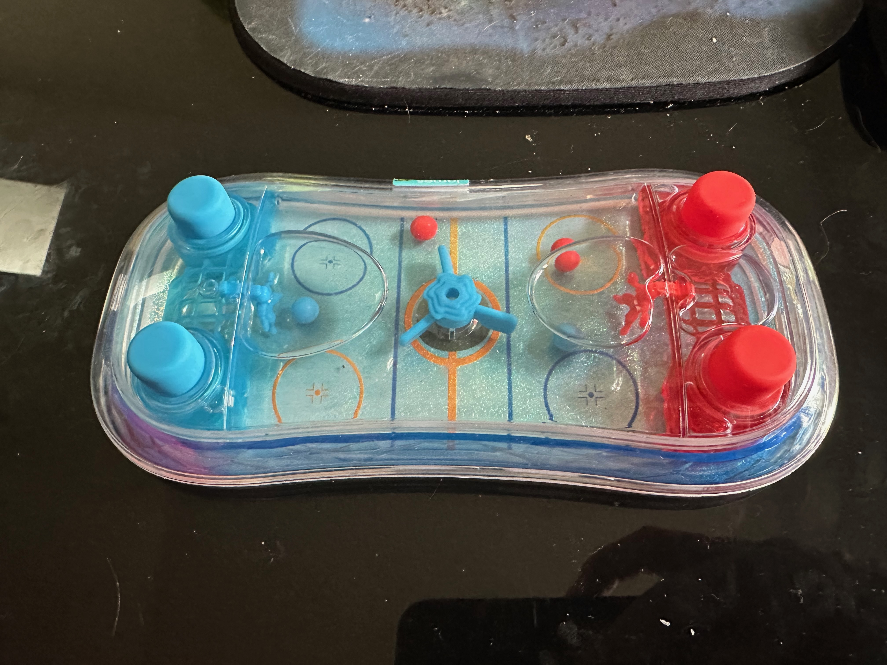

# Waterball Game 🌊🏒

Mobile adaptation of the classic water-filled handheld hockey game where players use water jets to push balls into opponent goals.

## 🎯 Project Overview

**Platform:** iOS (Android planned for v2.0)  
**Engine:** Unity 2022.3 LTS  
**Timeline:** 10 weeks from setup to App Store  
**Methodology:** Test-Driven Development (TDD)

## 🚀 Quick Start

### For Developers
1. **Setup:** Follow [Unity Setup Guide](UNITY_SETUP.md)
2. **Architecture:** Review [Technical Architecture](ARCHITECTURE.md)  
3. **Development:** Start with [Development Plan](DEVELOPMENT_PLAN.md)

### For Project Managers
1. **Requirements:** See [Project Requirements](PROJECT_REQUIREMENTS_DOCUMENT.md)
2. **Roadmap:** Check [Development Plan](PLAN.md)
3. **Progress:** Track in [Tasks](TASKS.md)

### For Designers
1. **Game Analysis:** Review [Game Mechanics](GAME_MECHANICS.md)
2. **UI Design:** See [UI/UX Design](UI_UX_DESIGN.md)
3. **Performance:** Check [Performance Targets](PERFORMANCE_TARGETS.md)

## 📋 Documentation

| Category | Documents | Purpose |
|----------|-----------|---------|
| **Planning** | [Requirements](PROJECT_REQUIREMENTS_DOCUMENT.md), [Plan](PLAN.md), [Tasks](TASKS.md) | Project scope and roadmap |
| **Technical** | [Architecture](ARCHITECTURE.md), [Unity Setup](UNITY_SETUP.md), [Physics](PHYSICS_DESIGN.md) | Implementation guides |
| **Development** | [TDD Plan](DEVELOPMENT_PLAN.md), [Testing](TESTING_STRATEGY.md), [UI/UX](UI_UX_DESIGN.md) | Development methodology |
| **Performance** | [Targets](PERFORMANCE_TARGETS.md), [Optimization](PERFORMANCE_TARGETS.md) | Quality standards |

## 🎮 Game Features

### Core Gameplay
- ✅ Two-player local multiplayer
- ✅ Physics-based water simulation
- ✅ Touch controls for water jets
- ✅ Goal detection and scoring
- ✅ Multiple game modes

### Technical Highlights
- 🎯 **60 FPS** on modern iOS devices
- 🌊 **Realistic water physics** with particle simulation
- 📱 **Responsive controls** with haptic feedback
- 🎨 **Clean UI design** with accessibility support
- ⚡ **Optimized performance** across device range

## 🛠 Development Status

**Current Phase:** Documentation & Planning ✅  
**Next Phase:** Unity Project Setup

### Completed
- [x] Game mechanics analysis
- [x] Technical architecture design
- [x] Complete project requirements
- [x] 10-week development plan
- [x] Unity setup specifications
- [x] Physics simulation design
- [x] Comprehensive testing strategy
- [x] UI/UX design system
- [x] Performance optimization targets

### Upcoming
- [ ] Unity project initialization
- [ ] Basic scene setup
- [ ] Water physics integration
- [ ] Touch input system
- [ ] Game logic implementation

## 📊 Development Phases

| Phase | Duration | Focus | Deliverables |
|-------|----------|-------|--------------|
| **Phase 1** | Week 1 | Foundation | Unity setup, basic scene |
| **Phase 2** | Week 2-3 | Core Mechanics | Ball physics, input system |
| **Phase 3** | Week 4-5 | Water Physics | Realistic water simulation |
| **Phase 4** | Week 6 | Game Logic | Scoring, state management |
| **Phase 5** | Week 7 | UI/UX | Complete interface |
| **Phase 6** | Week 8 | Multiplayer | Local split-screen |
| **Phase 7** | Week 9 | Polish | Performance, effects |
| **Phase 8** | Week 10 | Release | App Store submission |

## 🎯 Success Metrics

- **Performance:** 60 FPS on iPhone 12+, 30 FPS minimum on iPhone X
- **Quality:** 4.5+ star rating target
- **Usability:** <30 second learning curve
- **Technical:** 80% test coverage, zero critical bugs

## 🤝 Contributing

### Development Workflow
1. Read [CLAUDE.md](CLAUDE.md) for AI assistant guidelines
2. Check [TASKS.md](TASKS.md) for current priorities
3. Follow [TDD methodology](DEVELOPMENT_PLAN.md#tdd-cycle-for-unity)
4. Update documentation with changes

### Code Standards
- Test-driven development (write tests first)
- 80% minimum test coverage
- Follow Unity best practices
- Document all physics calculations

## 📞 Support

- **Issues:** Use GitHub Issues for bugs and features
- **Documentation:** All specs in this repository
- **Setup Help:** See [Unity Setup Guide](UNITY_SETUP.md)
- **Architecture Questions:** Review [Technical Architecture](ARCHITECTURE.md)

## 📄 License

[Add license information when determined]

---

**Made with Unity 2022 | iOS 14.0+ | Test-Driven Development**