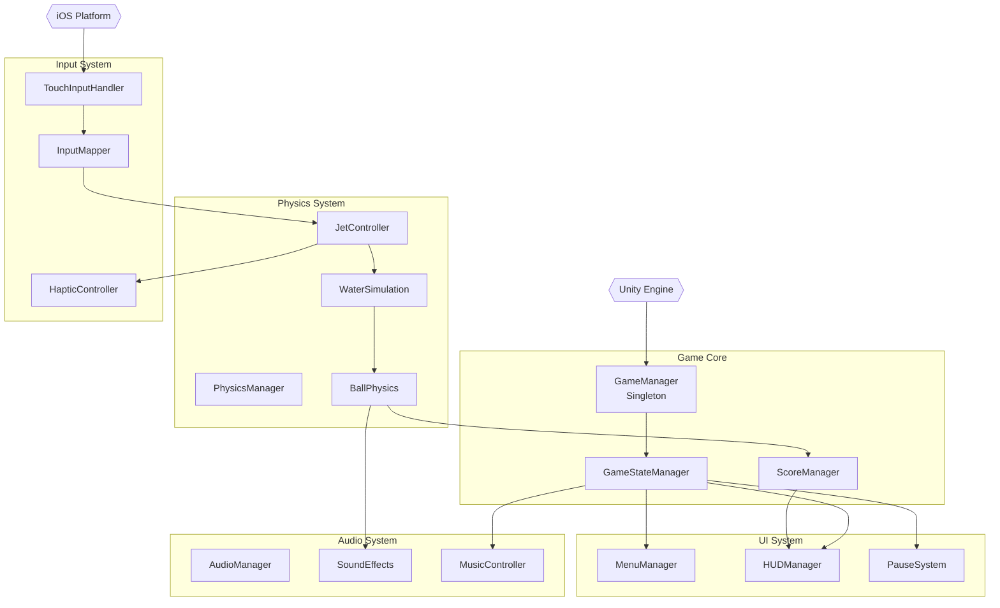
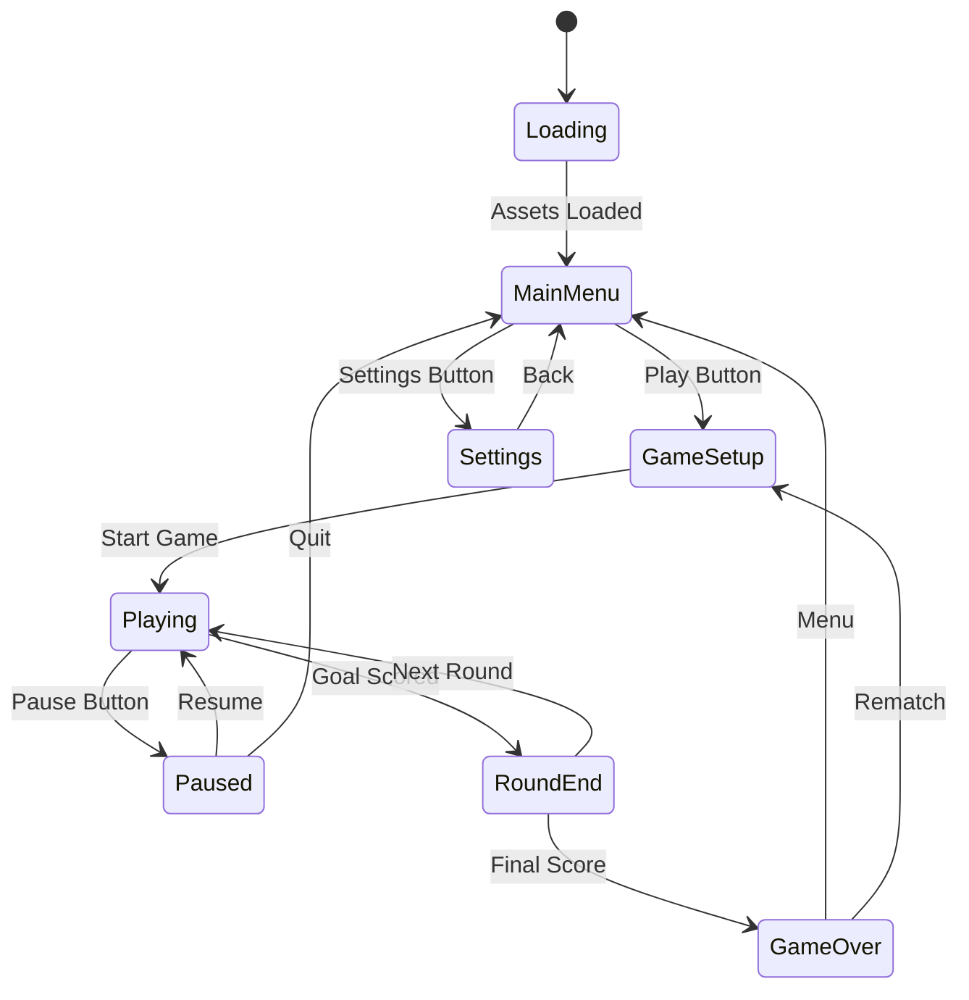
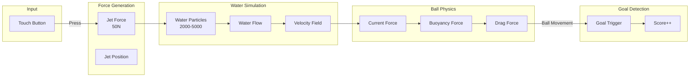
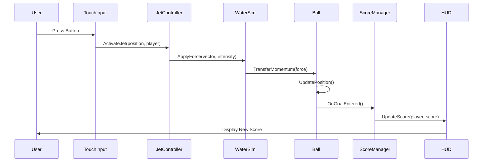
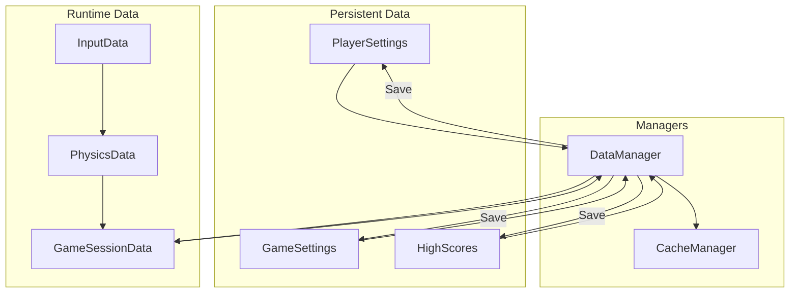
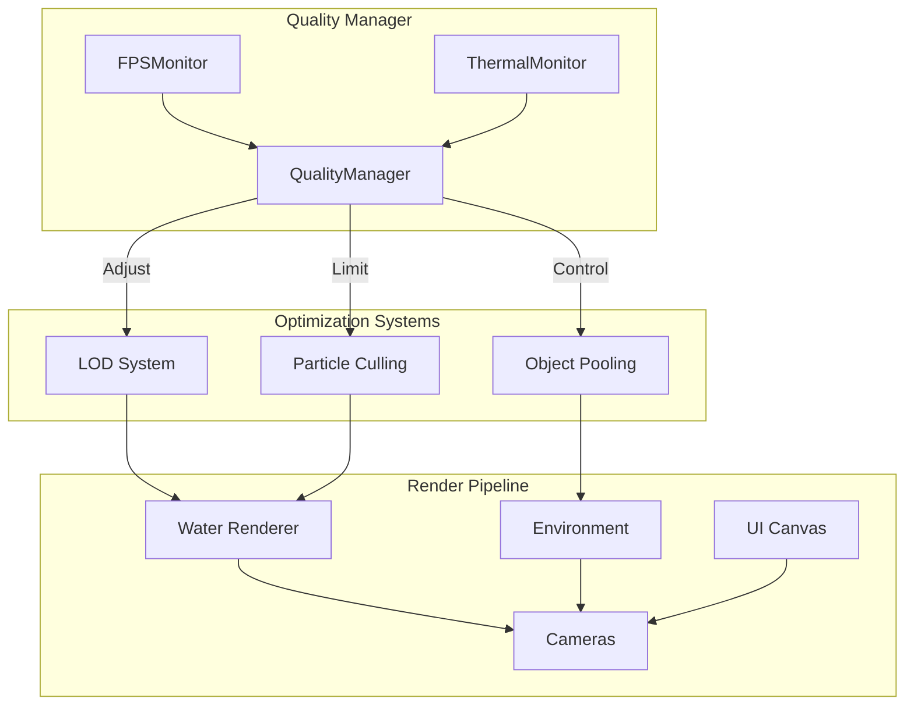
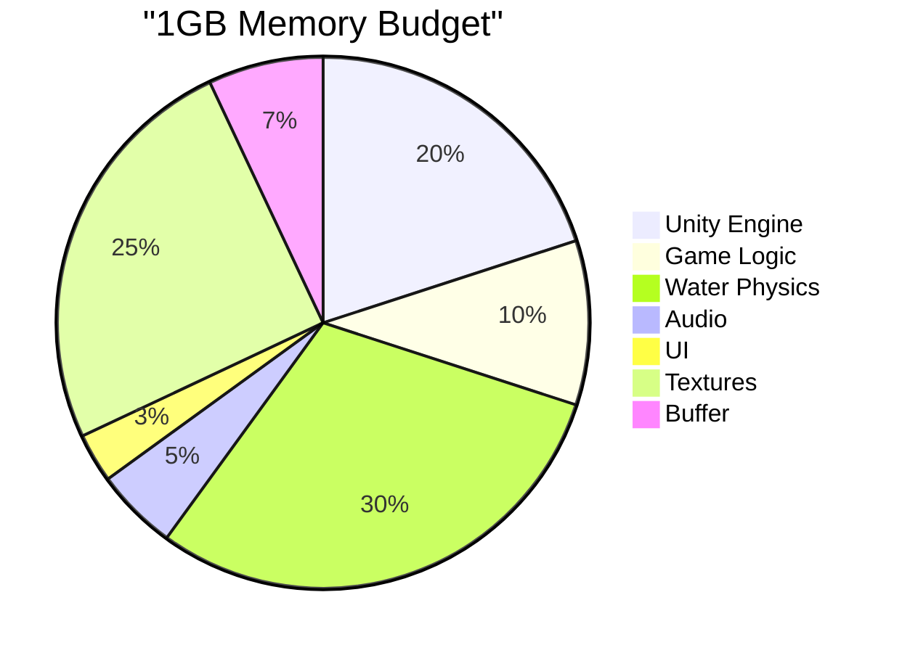

# Architecture Diagrams - Waterball Game

**Navigation:** [← Back to Reference](DOCUMENTATION_IMPROVEMENTS.md) | [Back to Index](../INDEX.md) | [Technical Architecture →](../technical/ARCHITECTURE.md)

## System Architecture Overview



## Game State Flow



## Physics System Flow



## Component Communication



## Data Flow Architecture



## Performance Architecture



## Unity Scene Hierarchy

```
WaterballGame Scene
├── _Managers
│   ├── GameManager
│   ├── AudioManager
│   ├── InputManager
│   └── UIManager
├── _Environment
│   ├── PlayingField
│   ├── Goals
│   ├── Boundaries
│   └── Lighting
├── _Physics
│   ├── WaterSystem
│   ├── BallSpawner
│   └── JetEmitters
├── _UI
│   ├── MainCanvas
│   ├── HUD
│   └── Menus
└── _Cameras
    ├── MainCamera
    ├── Player1Cam (Multiplayer)
    └── Player2Cam (Multiplayer)
```

## Memory Allocation Strategy



---

**Usage Notes**:
- Keep these diagrams visible while coding
- Update when architecture changes
- Use for onboarding future team members
- Reference in code comments: `// See ARCHITECTURE_DIAGRAM.md#game-state-flow`